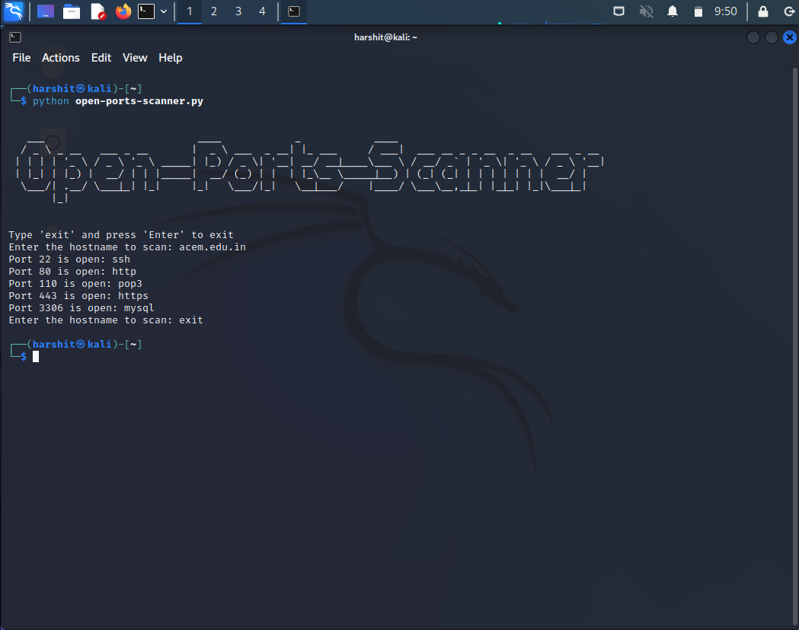

# open-ports-scanner
It is a simple Python script that allows users to scan for open ports with a specified hostname. Simply input the hostname, and the script will return a list of open ports on the host. This script is useful for network administrators and security professionals to quickly identify open ports on a network, which can aid in identifying potential vulnerabilities. The script is easy to use and can be integrated into larger network management or security tools.
## Features

- Easy to Use
- Quick results in seconds
- Provides a simple command line interface

## Usage

Clone open-ports-scanner repository
```
git clone https://github.com/itsraiharshit/open-ports-scanner
```
Navigate to Open-Ports-Scanner folder
```
cd open-ports-scanner
```
Run the script
```
python open-ports-scanner.py
```


#### Warning
Enter just the domain name of the website not the complete url. Only one domain name at a time.
